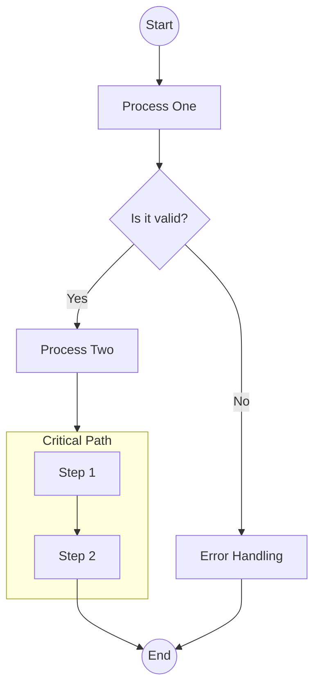
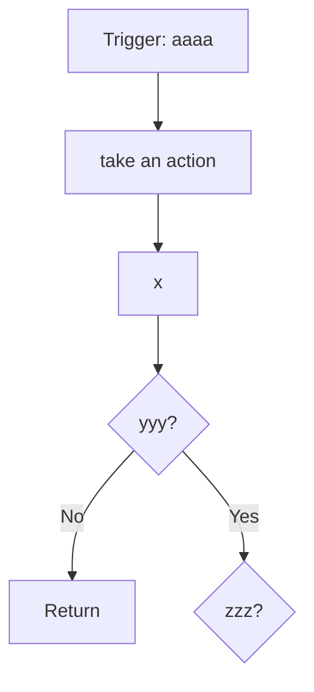

This playground is used to verify core engine changes in real-time. Use this to ensure your modifications to the Markdown parser or UI components behave as expected.

::: callout tip "How to work here"
To test your changes, keep the dev server running (`pnpm run dev`). Any change you make to `packages/core` or `packages/parser` will trigger a hot-reload here instantly.
:::

## Component Verification

Test your UI components and parser rules here to ensure consistency:

::: card "Container Test"
    Test nested callouts and containers.

    ::: callout warning "Warning"
    Ensure nested items render correctly.
    :::
:::

::: tabs
== tab "Feature A"
### Feature A
Verification content.
== tab "Feature B"
### Feature B
Verification content.
:::

## 🔗 Useful Links

- [Official Documentation](https://docs.docmd.io)
- [GitHub Repository](https://github.com/docmd-io/docmd)
- [Report an Issue](https://github.com/docmd-io/docmd/issues)

## 🧪 Developer Checklist
- [ ] **Parser:** Does the Markdown output match the HTML in `packages/parser/src/html-renderer.js`?
- [ ] **UI:** Does the theme CSS apply to this page correctly?
- [ ] **SPA:** Does navigation between pages work without a hard refresh?

## 🧜‍♀️ Mermaid Interactive Test

Test the new interactive controls (Pan, Zoom, Fullscreen) and Lucide icon support here:

### Complex Flowchart


### Architecture Diagram (Lucide Icons)


### Code Block with Title
```typescript "main.ts"
function hello() {
  console.log("Hello from docmd!");
}
```

## Math Plugin Test

$$
\sum_{i=1}^n i^2 = \frac{n(n+1)(2n+1)}{6}
$$

