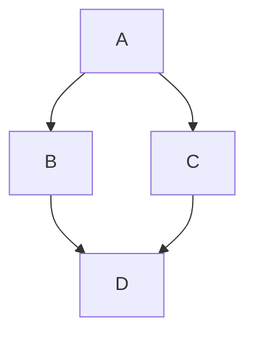

# @docmd/plugin-mermaid

Adds [Mermaid.js](https://mermaid.js.org/) diagram support to your docmd site - write flowcharts, sequence diagrams, and more directly in Markdown using a standard code fence. Bundled with `@docmd/core`.

````md

````

Part of the **[docmd](https://github.com/docmd-io/docmd)** documentation engine.

## Documentation

See **[docs.docmd.io](https://docs.docmd.io)** for full usage and API reference.

## License

MIT